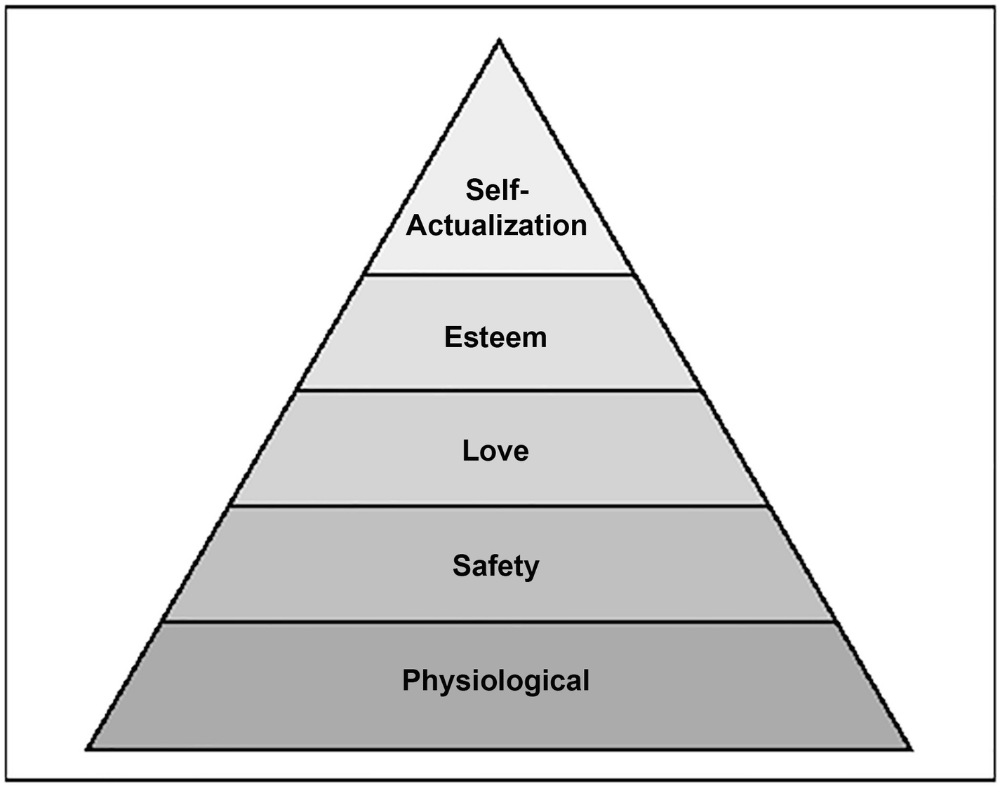
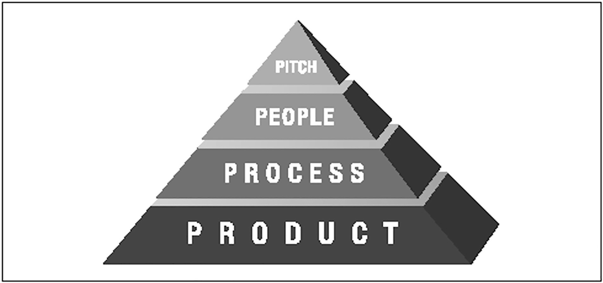
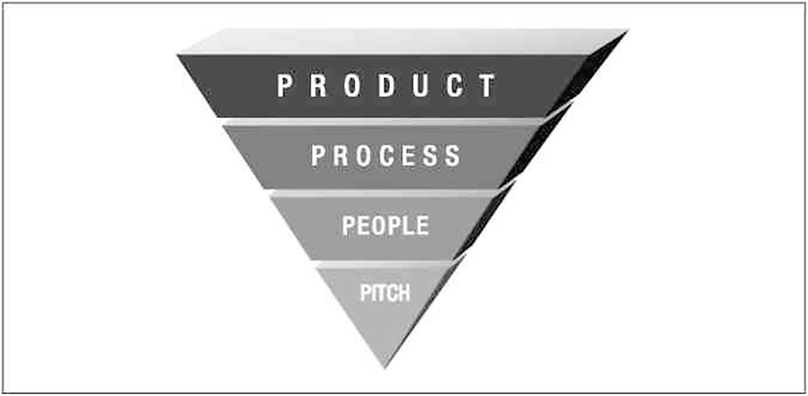

# 24. 1.0
> 最难建造的东西
> 迈克尔·洛普
> (1)
> 美国加利福尼亚州洛斯加图斯

麦克斯一团糟。当它刚从他身上倾泻而出时，我们正在萨拉托加盆地喝第三杯莫吉托。过去 72 小时涉及以下内容：
在洛杉矶照顾客户的数据中心两天。
四个小时的睡眠。
与妻子在手机上发生了两次巨大的争吵。
与他的老板进行了一次马拉松式的电话会议，结果两天后他又去了一次芝加哥。
莫吉托可能一直在说话，但听起来 Max 确信他的妻子会离开他；他的公司即将崩溃；他在飞行 12 小时和一架飞机后精神崩溃。
他说，“发布 1.0 产品不会杀死你，但它会尝试。”

## 理解 1.0

在你作为软件开发人员的职业生涯中，你将在某个时候被搞砸。我的建议是继续思考，不要大喊大叫，体面地对待和你一起工作的人，你会没事的。这是宝贵的经验，但与1.0相比就不算什么。
1.0 正在开发新产品的第一个版本。这就是所有这些初创公司现在都在忙着做的事情。他们正在研究一些 1.0 的想法，这个想法足够好，少数聪明人会为了支持正确的机会而放弃自己的生命。看，我们有一个好主意。我们是亿万富翁，我们是对的。
大多数初创公司都失败了。
在 Fucked Company 网站出现之前，失败是一件安静而阴郁的事情。 .com 的爆炸让巨大的熄火成为头版新闻，每个人都发现了我们大多数人已经知道的事情。
真的。大多数初创公司都失败了。
为什么？
为了理解 1.0 的难度，我需要给你一个模型来理解 1.0 软件产品实际上是如何出现的。我通过大量借鉴马斯洛的需求层次结构设计了这样一个模型，它的孤独值得一提。
马斯洛的理论认为，当人类满足他们的基本需求时，他们会寻求依次满足占据一定等级的更高需求，如图 24-1 所示。

图 24-1 马斯洛的需求层次
金字塔底部是最大的需求领域：生理需求。这些是基础：食物、饮料、空气、睡眠等。这个想法是，如果这些需求得不到满足，你将无法专注于层次结构中的其他任何事情。可以这样想：如果你不能呼吸，谁在乎坠入爱河？
沿着等级上升，你有安全需求、爱/归属感、尊重，最后是金字塔的奇怪命名的“自我实现”尖端，这是我们充分利用我们独特能力的本能需求。翻译：作家写作，歌手唱歌。
如果我激起了你的兴趣，维基百科中有一个关于马斯洛层次结构的很好的条目（见 http://en.wikipedia.org/wiki/Maslow's_hierarchy_of_needs）。就个人而言，作为人类的管理者，在与处于边缘的人打交道时，我会盯着等级制度。层次结构让我深入了解一个人的压力到底在哪里。他们需要职业建议吗？ （简单。）或者他们需要婚姻建议吗？ （更难。）

## 兰兹 1.0 层次结构

在思考 1.0 的难点时，我意识到马斯洛模型适用于发布产品的第一个版本。有一个层次结构定义了发布 1.0 需要构建的内容，如图 24-2 所示。

图 24-2Rands 1.0 层次结构
关于图表和图形的注意事项：Borland 的创始人 Phillippe Kahn 讲述了一个关于统计学的精彩故事，我认为这同样适用于图表和图形。故事是这样的，“你知道吗，脚大的人拼写能力更好，这是一个统计事实吗？ [插入敬畏。]这是因为脚大的人年龄更大。”
Charts ‘n’ 图表以一种干净、线性的方式描绘世界，其目的只有一个：支持作者的信息。不要相信图表，但不要因为缺乏信任而忽视了故事的意图。

### Pitch

在层次结构的顶部，有你的好主意。我称它为“音调”，因为我有这个头韵的事情。如果没有出色的宣传，你将无法在构建产品或公司方面取得任何进展。你是否是魅力先生并不重要；你必须有这个想法，因为它定义了它下面所有东西的结构和约束。如果你没有这个想法，你不知道该雇佣谁，这是第二层——人。
在我们谈论这个第二层之前，让我先祝贺你。我很高兴你发现了下一件大事，但有一些基本的事实需要注意。第一个是
事实#1：你很着急。不要忘记它。
如果你认为自己对自己的音调拥有专有权，那你就是傻瓜。有太多聪明人盯着完全相同的无限不断发展的信息，以假设你的创新是原创的。唯一能给你这个权利的是交付 1.0，首先，你需要一些人。

### 人

有了你的推销，你会找到人来建立你的想法。这些是你的创始人。这些人不仅会构建你的 1.0，而且更重要的是会构建你的工程文化。他们的到来给金字塔带来了挑战和扭曲。
你的前几名员工进入了一张白纸。是的，他们是球场的信徒——否则他们不会在大楼里——但现在这是他们的球场，这意味着他们会提出一些棘手的问题，因为他们在比赛中有一些皮肤。这些难题将帮助他们开始对最终产品做出决定。
作为球场的守门员，你将尝试保持参与，但你根本无法做出每一个决定。你的工作是不停地倾听和观察，这样你才能发现你的人的决定和行动是如何慢慢改变你的音调的。这将我们引向了我们的转折点。 Rands 1.0 Hierarchy 比 Maslow 的可怕得多，因为它看起来真的像图 24-3。

图 24-3 Real Rands 1.0 层次结构
人们不这样建造金字塔是有充分理由的——它们会倒塌。防止它们摔倒的唯一方法是不断推动一侧或另一侧。这是你的创业。这是一个不切实际的概念，你的音高位于底部，定义了它上面的一切。关于 1.0 会让你丧命的将是你将花费多少时间来保持这个金字塔的平衡，这让我们回到手头的话题：人。另一个基本事实：
事实#2：没有人是不可或缺的。
现在，我是一个人。整本书都致力于弄清楚如何确保人们相处融洽并完成工作，但我们在这里谈论的不是一家成熟的公司。我们谈论的是 1.0，规则不同，因为你是一个未知的数量，每个人都希望你失败。
曾经生过火吗？你需要什么？一根火柴、一些纸和一些容易着火的木柴。你的前三个雇员是你的火种。他们的工作不是定义产品路线图，他们的工作是推动事情进展，如果事情没有进展，你需要获得更多木材。
在我的创业公司，我被任命为第一位工程经理。创始人带来了两个性质完全不同的自由电子（有关自由电子的更多信息，请参见第 43 章）。一个是在完成一个工作原型时开夜车。他完全知道我们会抛弃整个事情，但他知道在代码中看到想法的能力会改变每个人对我们正在做的事情的看法。这将使球场变得真实。
另一个电子也喜欢这个音调，但他正在为未来的产品开发基础设施。他是什么？是的，我们没有产品，我们的一名关键员工已经在投资未来。什么时候投资未来是个坏主意？当现在没有定义时怎么样？第二个自由电子在 1.0 会成功的假设下工作，虽然我很欣赏他的热情，但让我们记住事实 #0：初创公司几乎总是失败。
我花了一些时间在第二个自由电子上，因为它经常与非常聪明的人一起执行任务，很明显他不会受到影响，所以我让他走了。那天。与我们的副总裁进行了一次快速会面，并完成了。
正如你将在第 43 章中了解到的，你不会经常遇到这类令人惊叹的工程师。对大多数公司来说，发射自由电子是非常愚蠢的，因为它们有很大的潜力，但交易是这样的：在 1.0 完成之前，你不是一家公司。推翻刚刚起步的金字塔的一个好方法是雇佣那些没有紧迫感地完成产品的人。完成 1.0，然后担心接下来会发生什么。

### 过程
没有什么词比过程更让工程师感到厌烦。立即尝试。让每个人都到你的办公室，说一些类似的话，“我已经定义了一个新流程来帮助我们的错误分类。”看着他们的脸下垂。他们听到“忙碌的工作”。他们认为，“管理层正试图为自己辩解。”
这不是定义层次结构第三级的词。这个词就是沟通。
事实#3：流程定义了沟通。
流程是你的团队进行沟通的手段。无论是通过 wiki、电子邮件还是走廊，任何大于一个的团队都需要定义一种共享信息的方式。这不是规范、文档或充满注意事项的白板的论据。你只需要同意你将如何共享信息。
当你的第二位工程师决定“是的，我将在 wiki 中记录我的设计决策”时，这就是过程。当你的第三位工程师开始在会议室中那块巨大的白板上跟踪错误时，这就是过程。不一定要好，也不一定要普遍认同，只要贴在人人都能看到的地方就行了。
当我第一次启动时，Microsoft 的 SourceSafe 是首选的存储库。不要笑了。它在一个由 6 名工程师组成的团队中做得很好，他们零时间担心源代码控制。当然，它慢得像地狱一样，因为各种小问题，在这里和那里失去了一天的工作，但我们正在开发 1.0，谁有时间考虑更可靠的东西？
罗兰做到了。
Roland 是一名初级工程师，他是 Perforce 的粉丝。罗兰做了创业公司任何优秀员工都会做的事情。在一个周末的过程中，他设置了一个 Perforce 服务器，重写了我们所有的构建工具，并安排了下周一上午 10 点的会议，承诺 Krispy Kreme 甜甜圈。他的信息是：“事情就是这样。一切都更好。谢谢你，吃个甜甜圈。”
在一个周末，Roland 修复了我们流程中的一个主要缺陷（糟糕的工具），并且还展示了另一个层次结构的事实：
事实#4：每一层都会塑造并移动靠近它的层。
健康金字塔的一个明确标志是一层侵入另一层。将人员、流程和音调的每一次变化都看作是朝着一个方向的推动。这种运动需要其他层的补偿，否则整个事情就倒了。 Roland 改变工程流程的决定激怒了一些人。我们在一些 Roland 没有想到的源管理边缘案例上浪费了一些时间，但是，在一周内，我们就做出了调整。即使是最直言不讳的反对者，最终也会在 Roland 的办公室里争论我们如何才能让它变得更好。
如果在你的组织中，你的金字塔没有不断调整以保持其直立，那么一定有问题。如果新人不测试音高，他们要么不买，要么不明白。如果你的工程师不是一直在争论他们开发软件的方式，他们就会变得停滞不前，这会渗透到你的音调中，并渗透到你的产品中。
在 1.0 期间，一个伟大的停滞警告信号是当有人决定创建一个组织结构图来定义“这是谁做的”。现在，投资者和外部各方需要这个组织结构图来了解你是否真实，但你的 1.0 团队却没有。房间角落的白板，列出了谁在做什么，是你的组织结构图。组织结构图描绘的定义和层次结构是在你的组织中创建保密文化的第一步。这可能适用于 Apple，但你还不是 Apple。你是希望和努力。

### 产品
在某些时候，你需要假装完成。你将需要发布一些看起来几乎不像你的推销的东西，因为在一个中立的一方盯着某个东西之前你没有产品。
事实 5：只有拥有产品，才能拥有公司。
产品不是沥青。 Pitch 是一个三句话的想法，它使你有信心聘请员工。人们就音高争论不休，他们创造了改进和发展音高的流程，这改变了它。在这一切过程中，金字塔来回摇晃。也许它完全倒塌了，你又争先恐后地把这些层叠起来。干得好，在那里。你还没有产品。
中立的各方，你的客户，需要了解你一直在构建的东西，因为你所有的人都完全疯了。金字塔的所有健康转移都在给他们带来负担。每一次推动都迫使他们调整对球场的看法，与球场的关系，适应变化真是太累了。说“我喜欢改变”的人目前不在初创公司工作。初创公司的人不会说太多，因为他们正忙于适应最新的金字塔转变。
这种不断变化的状态是启动倦怠的主要原因，也是你必须淘汰该产品的原因。中立方的观点是必不可少的验证，因为你疯了。你的音调已经被剖析和重新定义了很多次，它可能不再是有用的东西。一个中立的一方不在乎球场、你的人或任何你一直在推动的金字塔；他们只关心产品是否有用。

## 使用金字塔
在组织危机期间，你绝不会在白板上画出这个层次结构，然后说：“伙计们，注意金字塔——兰兹是这么说的。”这个想法是给你一个提醒你的工具，“嘿，一切都连接起来了！”球场引导人们。人们改进了音调。人和推销创造流程和产品，是的，这一切都是一团糟，这就是初创公司失败的原因。
金字塔为你提供了一张模糊的地图，用于思考你的公司可能面临的问题。人们会在走廊里大喊大叫，这听起来像是在讨论产品，但请继续倾听，也许这就是过程。更糟糕（更好？），也许是音高。作为球场管理员，你的一项工作是弄清楚正在测试金字塔的哪一层，然后找出推金字塔的方法。这将我们引向了最后一个事实：
事实 6：故障越靠金字塔越低，成本就越高。
我创业一年后，创始人正处于十字路口。我们正在开发一个专为现场部署而构建的企业 Web 应用程序。问题是，每个人都对托管服务感到困惑。那里的宣传是：“看看我将这个应用程序托管在我的数据中心，而不是你的数据中心，可以为你节省多少时间和精力。”这个想法在面对 Oracle、PeopleSoft 和 IBM 多年来对位于你的数据中心的大量业务软件和硬件的统治时飞速发展，但它是互联网，互联网将拯救世界。
创始人改变了他们的音调。 “我们只会在我们的数据中心创建软件的副本！我们会省钱，让我们的东西离家近一点！”没有很大的区别吗？错误的。对我们的音调的这种调整改变了我们产品的基本架构。我们不必将数百个定制版本的软件放置在各个数据中心，而是必须拥有一份可根据每个客户的需求进行配置的软件副本，而这不是我们设计的产品。
这不是一场即时的灾难。我们有大量资金可以投入到这次转型中，但转型成本变得如此之大，以至于除了让托管应用程序正常工作之外，我们停止了任何其他工作，而就在那时，泡沫破灭了。
让我们称“失败”是一个非常糟糕的决定。当你选择改变某些东西并且这种改变渗透到金字塔中时。如果你在版本控制方面做出了错误的决定，那么你可能可以适应这一点。你可以发射一个自由电子，可能会找到另一个能更好地引导音调的聪明人，但你可能会比你想象的更加嘎嘎作响。推销失败是一种影响整个公司的结构性故障。公司中的一切都取决于你所提出的愿景，而将其搞砸可能是致命的。

## 建筑文化

如果你真的准备好了一个音高，再一次，那太棒了。我拼凑起来的这个完全概念化的模型并未涵盖你需要了解的一些主要主题。你打算如何资助这件事？你在哪里找到风投？你在哪里找到优秀的人？你的生活将变成无穷无尽的问题和决定清单，你可能会忘记我刚刚在你疯狂的冲刺中写的所有内容，以保持你的演讲活力，所以我会简化。我描述的层次结构不是如何构建伟大产品的模型；这是一张描述贵公司文化建设的图片。这就是你在 1.0 中真正构建的内容。一种持久、有趣的文化，如果幸运的话，它会继续生产出出色的产品。
想想你最喜欢的五家公司，并想想是什么让他们成功。是的，他们可能有一个很棒的 1.0。想想你第一次看到 Mac 是什么时候。想想你第一次看到 Netscape 的情景。你在 Google 上的第一次有用搜索怎么样？这些产品是人们为了把该死的东西推出门而自杀的最终结果，但这些人不仅仅是在创造那种产品。他们的工作定义了公司的文化，这也是他们未来成功的典范。
这就是 1.0 试图杀死你的原因。 1.0 期待你低估它。 1.0 想让你认为你正在构建的只是一个产品，但产品只是结果。一个成功的 1.0 是由发布的产品的成功来衡量的，但它是由看似无穷无尽的决策、争论、失败和成功构建的，而这些决策、争论、失败和成功将教会你你需要知道的一切，但是是，不方便，试图杀了你。